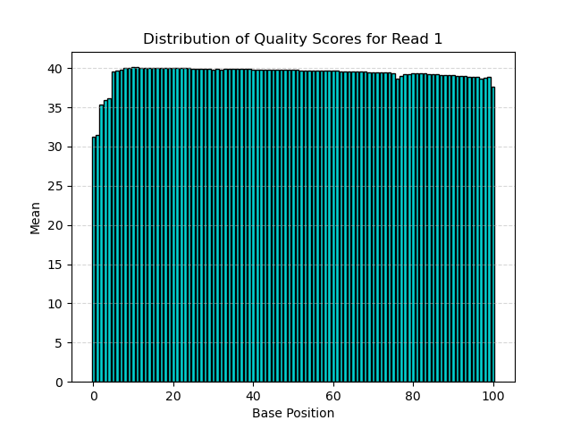
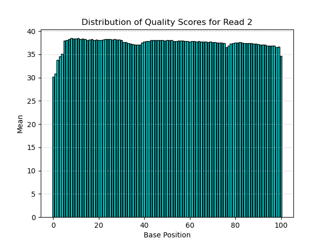

# Assignment the First

## Part 1
1. Be sure to upload your Python script. Provide a link to it here:  
   [script that generates the data](./histogram_generator_part1.py)  
   [script that plots the data generated](histogram_generator_part2.py)

| File name | label | Read length | Phred encoding |
|---|---|---|---|
| 1294_S1_L008_R1_001.fastq.gz | read1 | 101 | Phred+33 |
| 1294_S1_L008_R2_001.fastq.gz | index1 | 8 | Phred+33 |
| 1294_S1_L008_R3_001.fastq.gz | index2 | 8 | Phred+33 |
| 1294_S1_L008_R4_001.fastq.gz | read2 | 101 | Phred+33 |

2. Per-base NT distribution
    1. Use markdown to insert your 4 histograms here.
    
    
    
    
    2. **YOUR ANSWER HERE**
    3. 7304664 indexes
    ```
      echo $(( $(zcat 1294_S1_L008_R2_001.fastq.gz | sed -n '2~4p' | grep -c 'N') + $(zcat 1294_S1_L008_R3_001.fastq.gz |  sed -n '2~4p' | grep -c 'N') ))
    ```
    
## Part 2
1. Define the problem
2. Describe output
3. Upload your [4 input FASTQ files](../TEST-input_FASTQ) and your [>=6 expected output FASTQ files](../TEST-output_FASTQ).
4. Pseudocode
5. High level functions. For each function, be sure to include:
    1. Description/doc string
    2. Function headers (name and parameters)
    3. Test examples for individual functions
    4. Return statement
